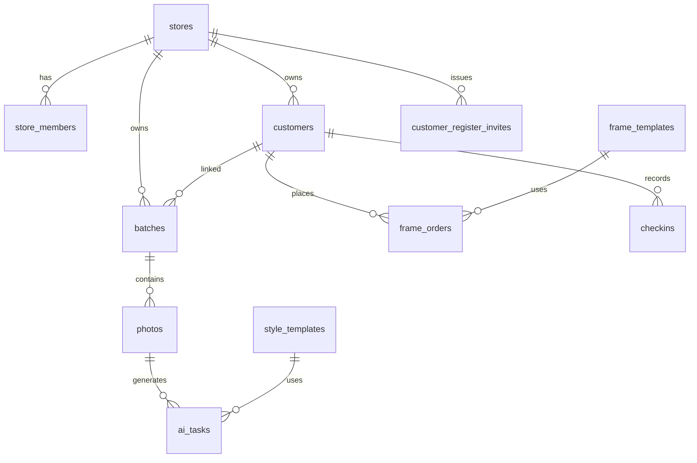

# 云数据库集合说明

微信云开发会在**首次写入时自动创建集合**。本文档与当前代码库保持一致，列出项目用到的**全部集合**及字段含义。新增表或字段时，请同步更新本文档。

---

## 约定与 ID 说明

| 概念 | 格式 / 位置 | 说明 |
|------|-------------|------|
| 门店 ID | `store_` + 8–32 位字母数字 | **仅作为 `stores` 文档的 `_id`**，正文一般不重复写 `storeId` 字段 |
| 顾客文档 ID | 云数据库自动 `_id` | **唯一顾客标识**：打卡码、扫码、订单、批次、照片、打卡记录均用 **`customers._id`** |
| 风格业务 ID | `style_templates.id`（如 `S01`） | AI 任务 `ai_tasks.templateId`、提交任务时引用 |
| 相框业务 ID | `frame_templates.id` | 摆台订单 `frame_orders.frameTemplateId` |

**关联字段命名**

| 集合 | 字段 | 含义 |
|------|------|------|
| `batches` / `photos` / `frame_orders` | `customerId` | 指向 `customers._id`（历史字段名，值为文档 ID） |
| `checkins` | `customerDocId` | 指向 `customers._id` |

---

## 集合总览

| 集合 | 用途 | 主要写入方 |
|------|------|------------|
| `stores` | 门店主档 | 云函数 `storeMember` |
| `store_members` | 门店成员与角色 | 云函数 `storeMember` |
| `store_invites` | 店员邀请加入门店 | 云函数 `storeMember` |
| `customers` | 顾客档案 | 云函数 `customer`、`storeMember`；门店小程序部分直写 |
| `customer_register_invites` | 顾客链接注册邀请 | 云函数 `storeMember` |
| `checkins` | 到店打卡记录 | 云函数 `customer` |
| `batches` | 云相册拍摄批次 | 小程序 `media.js`；关联客户走 `storeMember` |
| `photos` | 批次内单张照片 | 小程序 `media.js`、AI 流水线 |
| `ai_tasks` | AI 生成任务队列 | 云函数 `submitAITask` / `processTasksWorker` |
| `style_templates` | 写真风格模板 | 云函数 `adminApi` |
| `frame_templates` | 摆台相框模板 | 云函数 `adminApi` |
| `frame_orders` | 摆台相框订单 | 云函数 `orderApi` |
| `album_orders` | 相册订单（预留） | 配置已存在，业务未落地 |
| `platform_settings` | 平台级配置 | 云函数 `adminApi` / `storeMember` |

---

## `stores` — 门店主档

文档 **`_id` = 门店 ID**（`store_xxxxxxxx`）。创建门店时由 `storeMember.storeCreate` 写入。

| 字段 | 类型 | 必填 | 说明 |
|------|------|------|------|
| `_id` | string | 是 | 门店 ID，形如 `store_abc12345` |
| `accountType` | string | 是 | 固定 `store` |
| `name` | string | 是 | 门店名称 |
| `contactName` | string | 否 | 联系人 |
| `contactPhone` | string | 否 | 联系电话 |
| `address` | string | 否 | 地址文案 |
| `mapAddress` | string | 否 | 地图选点完整地址 |
| `addressName` | string | 否 | 地点名称 |
| `addressDetail` | string | 否 | 详细地址 |
| `distanceText` | string | 否 | 距离展示文案 |
| `houseNumber` | string | 否 | 门牌号 |
| `latitude` / `longitude` | number | 否 | 经纬度 |
| `avatarUrl` | string | 否 | 门店头像（云文件 ID） |
| `level` | string | 否 | 会员等级文案，如「普通会员」 |
| `balance` | number | 否 | 摆台相框可用次数，下单扣减 |
| `packageTotal` | number | 否 | 套餐总次数 |
| `packageUsed` | number | 否 | 已用套餐次数 |
| `packageExpireDate` | string / null | 否 | 套餐过期日 |
| `ownerOpenId` | string | 否 | 创建时店长 openId |
| `createTime` | number / Date | 是 | 创建时间 |
| `updateTime` | number / Date | 否 | 更新时间 |

**读取 / 写入**

- 读：`storeMember.storeGet`、小程序门店档案页
- 写：`storeMember.storeCreate` / `store.update`；`orderApi` 创建摆台订单时 `balance` 自减

**建议权限**：小程序端只读本人门店；写操作走云函数。

---

## `store_members` — 门店成员

| 字段 | 类型 | 必填 | 说明 |
|------|------|------|------|
| `_id` | string | 自动 | 文档 ID |
| `storeId` | string | 是 | 所属门店 `store_xxx` |
| `memberOpenId` | string | 是 | 成员微信 openId |
| `role` | string | 是 | `owner` 店长 / `staff` 店员 |
| `status` | string | 是 | `active` 已激活 / `pending` 待审核 / `disabled` 已禁用 |
| `nickName` | string | 否 | 成员称呼（店员申请时填写，店长不可改） |
| `phone` | string | 否 | 联系电话（申请时可选授权；店长可补录/修改） |
| `remark` | string | 否 | 店长备注（仅店长可见、可编辑；移出员工时清空） |
| `createTime` | number | 是 | 创建时间戳 |
| `updateTime` | number | 否 | 更新时间戳 |
| `approvedAt` | number | 否 | 审核通过时间 |
| `rejectReason` | string | 否 | 拒绝原因 |

**业务约束**

- 同一 `memberOpenId` 同时仅一个 `status: active` 门店（代码层校验）
- `account.resolve` 据此判断门店端 / 顾客端分流

**建议索引**：`memberOpenId` + `status`；`storeId` + `status`

---

## `store_invites` — 店员邀请

| 字段 | 类型 | 必填 | 说明 |
|------|------|------|------|
| `_id` | string | 自动 | 文档 ID |
| `token` | string | 是 | 邀请码（URL 参数） |
| `storeId` | string | 是 | 目标门店 |
| `createdBy` | string | 是 | 创建人 openId |
| `status` | string | 是 | `active` / `revoked` |
| `expireAt` | number | 是 | 过期时间戳（默认 24h） |
| `createTime` | number | 是 | 创建时间 |
| `updateTime` | number | 否 | 撤销时更新 |

**写入**：`storeMember.inviteCreate` / `inviteRevoke`  
**读取**：`invitePreview` / `inviteAccept`

**建议索引**：`token` + `status`

---

## `customers` — 顾客档案

| 字段 | 类型 | 必填 | 说明 |
|------|------|------|------|
| `_id` | string | 自动 | 文档 ID；**批次/订单关联用此字段** |
| `storeId` | string | 是 | 所属门店 `store_xxx` |
| `wxOpenId` | string | 否 | 微信 openId；链接注册、打卡绑定 |
| `wxNickName` | string | 否 | 微信昵称；**注册可写入**；**每次打卡**由扫码 payload 更新；小程序内不可手改 |
| `nickName` | string | 否 | **仅门店**称呼（店长备注）；链接注册时为空，顾客端不展示 |
| `avatarUrl` | string | 否 | 头像云文件 ID |
| `phone` | string | 是 | 11 位手机号；门店建档必填；链接注册须微信授权 |
| `source` | string | 否 | 来源：`store_create` / `link_register` / `self_register` 等 |
| `remark` | string | 否 | 门店备注 |
| `equityAlbum` | number | 否 | 相册权益次数 |
| `equityFrame` | number | 否 | 摆台权益次数 |
| `totalCheckins` | number | 否 | 累计打卡次数 |
| `lastCheckinTime` | number | 否 | 最近打卡时间戳 |
| `lastCheckinDate` | string | 否 | 最近打卡日期 `YYYY-MM-DD` |
| `boundAt` | number | 否 | 绑定门店时间 |
| `createdBy` | string | 否 | 门店建档时的操作人 openId |
| `createTime` | number | 是 | 创建时间 |
| `updateTime` | number | 否 | 更新时间 |

**展示名**（`utils/customerDisplay.js`）

- 门店端：优先 `nickName`，否则 `wxNickName`，否则「匿名用户」
- 顾客端：仅 `wxNickName`

**`wxNickName` 写入时机**

1. **链接注册** `register.complete`：可选传入 `wxNickName`；`nickName` 置空  
2. **到店打卡** `scan.bindCheckin`：扫码 JSON 含 `wxNickName` 时覆盖写入  
3. **打卡前同步** `profile.syncWx`：顾客首页点击同步微信昵称（刷新打卡码内容）  
4. **门店建档** `createByStore`：不写 `wxNickName`，待客户打卡同步  

打卡码 JSON 示例：`{"type":"customer_checkin","customerDocId":"<customers._id>","phone":"13800138000","wxNickName":"…","avatarUrl":"…"}`（无有效 `phone` 不生成打卡码）

**业务约束**

- 同一 `wxOpenId` 只能绑定一个 `storeId`
- 已是 `store_members` 的微信不能走顾客注册
- **手机号归属**：`wxOpenId` 为空（未认领）时门店可改 `phone`；已有 `wxOpenId` 时仅顾客端 `getPhoneNumber` 可改，`nickName`/`remark` 仍由门店维护
- **打卡**：已认领客户校验码内 `wxOpenId` 与档案一致；不以旧码覆盖库内 `phone`；码内手机号与库不一致时提示顾客刷新顾客码

**建议索引**：`wxOpenId`；`storeId` + `phone`；`storeId` + `createTime`

---

## `customer_register_invites` — 顾客注册邀请

| 字段 | 类型 | 必填 | 说明 |
|------|------|------|------|
| `_id` | string | 自动 | 文档 ID |
| `token` | string | 是 | 邀请码，注册页 URL 参数 |
| `storeId` | string | 是 | 目标门店 |
| `createdBy` | string | 是 | 创建人 openId |
| `status` | string | 是 | `active`（撤销可改为 `revoked`） |
| `expireAt` | number | 是 | 过期时间戳（默认 168 小时） |
| `createTime` | number | 是 | 创建时间戳 |

**写入**：`storeMember` → `customerRegisterInvite.create`  
**读取**：`customer` → `register.preview` / `register.complete`

**建议权限**：仅云函数读写，小程序勿直连。

**建议索引**：`token`；`storeId` + `status`

---

## `checkins` — 打卡记录

| 字段 | 类型 | 必填 | 说明 |
|------|------|------|------|
| `_id` | string | 自动 | 文档 ID |
| `storeId` | string | 是 | 门店 ID |
| `customerDocId` | string | 是 | 顾客文档 `_id`（`customers._id`） |
| `checkinDate` | string | 否 | 打卡日期 `YYYY-MM-DD`（部分统计按此字段） |
| `operatorOpenId` | string | 否 | 操作店员 openId |
| `createTime` | number | 是 | 打卡时间戳 |

**写入**：`customer` → `scan.bindCheckin`  
**读取**：`adminApi` 统计、小程序未打卡名单（兼容 `checkinDate` 与 `createTime` 区间）

**建议索引**：`storeId` + `checkinDate`；`storeId` + `createTime`

---

## `batches` — 云相册批次

| 字段 | 类型 | 必填 | 说明 |
|------|------|------|------|
| `_id` | string | 自动 | 批次 ID |
| `storeId` | string | 是 | 门店 ID |
| `customerId` | string | 否 | 关联顾客文档 `_id`；未关联为 `null` |
| `status` | string | 否 | 批次级状态：`pending` / `generating` / `completed` / `failed` |
| `photoIds` | array | 否 | 照片 fileID 或关联 ID 列表（上传时 `push`） |
| `createTime` | Date / number | 是 | 创建时间 |
| `updateTime` | Date / number | 否 | 更新时间 |
| `demoTag` | string | 否 | 演示数据标记（`seedGalleryDemo`） |
| `demoTitle` | string | 否 | 演示批次标题 |

**写入**

- 创建：小程序 `utils/media.js` → `_createBatch`
- 关联客户：**必须**走云函数 `storeMember` → `batch.linkCustomer`（更新本表及下属 `photos`）

**读取**：门店云相册 `pages/gallery`、顾客端 `packageCustomer/pages/gallery`

**建议索引**：`storeId` + `createTime`；`storeId` + `customerId`

---

## `photos` — 照片

| 字段 | 类型 | 必填 | 说明 |
|------|------|------|------|
| `_id` | string | 自动 | 照片 ID |
| `batchId` | string | 是 | 所属批次 `_id` |
| `storeId` | string | 是 | 门店 ID |
| `customerId` | string | 否 | 顾客文档 `_id`，与批次保持一致 |
| `originalUrl` | string | 是 | 原图云文件 ID（`cloud://`） |
| `aiUrl` | string | 否 | AI 成图云文件 ID |
| `isGenerated` | boolean | 否 | 是否已生成 AI 图 |
| `generateStatus` | string | 否 | `pending` / `processing` / `completed` / `failed` |
| `isFavorite` | boolean | 否 | 是否收藏（云相册「收藏」Tab） |
| `styleName` | string | 否 | 展示用风格名（可选） |
| `createTime` | Date / number | 是 | 创建时间 |
| `updateTime` | Date / number | 否 | 更新时间 |
| `demoTag` | string | 否 | 演示数据标记 |

**写入**：`media.js` 上传；`submitAITask` / `processTasksWorker` 更新生成状态；`batch.linkCustomer` 批量改 `customerId`

**建议索引**：`batchId`；`storeId` + `isFavorite`；`storeId` + `customerId`

---

## `ai_tasks` — AI 生成任务

| 字段 | 类型 | 必填 | 说明 |
|------|------|------|------|
| `_id` | string | 自动 | 任务 ID |
| `photoId` | string | 是 | 关联 `photos._id` |
| `templateId` | string | 是 | 风格业务 ID（`style_templates.id`） |
| `storeId` | string | 是 | 门店 ID |
| `status` | string | 是 | `pending` / `processing` / `completed` / `failed` |
| `resultFileID` | string | 否 | 生成结果云文件 ID |
| `errorMsg` | string | 否 | 失败原因 |
| `createTime` | Date | 是 | 创建时间 |
| `updateTime` | Date | 否 | 更新时间 |

**写入**：`submitAITask` 创建；`processTasksWorker` 消费并回写 `photos`

**建议索引**：`status` + `createTime`

---

## `style_templates` — 写真风格模板

| 字段 | 类型 | 必填 | 说明 |
|------|------|------|------|
| `_id` | string | 自动 | 文档 ID（Worker 偶发按此查询） |
| `id` | string | 是 | 业务 ID，如 `S01`（提交 AI 任务用） |
| `name` | string | 是 | 风格名称 |
| `prompt` | string | 是 | 生图提示词 |
| `sampleFileId` | string | 是 | 样图云文件 ID 或资源路径 |
| `imageUrl` | string | 否 | **遗留字段**；`processTasksWorker` 作背景图，可与 `sampleFileId` 解析 URL 并存 |
| `sort` | number | 否 | 排序权重，越小越靠前 |
| `enabled` | boolean | 否 | 是否启用（顾客端写真展仅展示启用项） |
| `createTime` | Date | 否 | 创建时间 |
| `updateTime` | Date | 否 | 更新时间 |

**写入 / 读**：`adminApi` CRUD；小程序 `config/styles.js` 拉启用列表；`styles.seedDefaults` 初始化 S01–S09

**建议索引**：`id`；`enabled` + `sort`

---

## `frame_templates` — 摆台相框模板

| 字段 | 类型 | 必填 | 说明 |
|------|------|------|------|
| `_id` | string | 自动 | 文档 ID |
| `id` | string | 是 | 业务 ID |
| `name` | string | 是 | 相框名称 |
| `coverFileId` | string | 否 | 封面云文件 ID |
| `material` | string | 否 | 材质说明 |
| `sort` | number | 否 | 排序 |
| `enabled` | boolean | 否 | 是否上架 |
| `sizeAxis` | string | 否 | 尺寸轴标识，默认 `lw` |
| `sizeUnit` | string | 否 | 单位，如 `cm` |
| `sizeFirst` | number | 否 | 尺寸一 |
| `sizeSecond` | number | 否 | 尺寸二 |
| `size` | string | 否 | 展示用尺寸文案 |
| `createTime` | Date | 否 | 创建时间 |
| `updateTime` | Date | 否 | 更新时间 |

**写入 / 读**：`adminApi` 相框管理；门店摆台选框页

---

## `frame_orders` — 摆台相框订单

| 字段 | 类型 | 必填 | 说明 |
|------|------|------|------|
| `_id` | string | 自动 | 订单 ID |
| `orderType` | string | 是 | 固定 `frame` |
| `orderNo` | string | 是 | 订单号，前缀 `OR` |
| `storeId` | string | 是 | 门店 ID |
| `customerId` | string | 否 | 顾客文档 `_id` |
| `frameTemplateId` | string | 是 | 相框模板业务 `id` |
| `frameName` | string | 是 | 相框名称快照 |
| `photoUrl` | string | 是 | 成片云文件 ID 或 URL |
| `styleId` | string | 否 | 关联风格 ID（可选） |
| `styleName` | string | 否 | 风格名称快照 |
| `status` | string | 是 | `待处理` / `制作中` / `已发货` / `已完成` |
| `shippingNo` | string | 否 | 物流单号 |
| `createTime` | Date | 是 | 创建时间 |
| `updateTime` | Date | 否 | 状态变更时间 |

**写入**：`orderApi` → `createFrameOrder` / `updateFrameOrderStatus`  
**读取**：门店订单列表、顾客端 `orders.list` / `orders.get`

**建议索引**：`storeId` + `createTime`；`storeId` + `status`；`customerId`

---

## `album_orders` — 相册订单（预留）

`orderApi/lib/config.js` 已配置集合名与单号前缀 `AL`，**当前无创建/查询实现**。若落地相册业务，建议字段参考 `frame_orders`，并在此文档补充。

---

## `platform_settings` — 平台配置

**固定文档 ID：`default`**（集合名 `platform_settings`，`_id` = `default`）。

| 字段 | 类型 | 必填 | 说明 |
|------|------|------|------|
| `_id` | string | 是 | 固定 `default` |
| `supportPhone` | string | 否 | 平台客服电话 |
| `updateTime` | Date | 否 | 最后更新时间 |

**初始化示例**

```json
{
  "supportPhone": "400-000-0000",
  "updateTime": "2026-05-19T00:00:00.000Z"
}
```

**读取**：`adminApi`、`storeMember.platform.settings`、小程序 `utils/platformSettings.js`

---

## 集合关系示意



---

## 权限建议（概要）

| 集合 | 小程序端 | 说明 |
|------|----------|------|
| `stores` / `store_members` / `store_invites` | 不直写 | 走 `storeMember` |
| `customer_register_invites` | 不读写 | 仅云函数 |
| `customers` | 门店可读；写称呼/备注可直写 | 敏感绑定走 `customer` 云函数 |
| `batches` / `photos` | 门店可读；创建批次/上传照片可直写 | **关联客户务必走** `batch.linkCustomer` |
| `ai_tasks` | 不直写 | 仅云函数 |
| `style_templates` / `frame_templates` | 只读启用项 | 管理走 `adminApi` |
| `frame_orders` | 门店/顾客按 openId 云函数读写 | 不建议客户端随意改状态 |
| `platform_settings` | 只读 `default` | 写走 `adminApi` |

---

## 建议索引汇总

| 集合 | 索引字段 | 用途 |
|------|----------|------|
| `store_members` | `memberOpenId`, `status` | 登录分流 |
| `store_invites` | `token`, `status` | 邀请校验 |
| `customer_register_invites` | `token` | 注册链接 |
| `customers` | `wxOpenId` | 注册/登录去重 |
| `customers` | `storeId`, `phone` | 门店内查重 |
| `checkins` | `storeId`, `checkinDate` | 打卡统计 |
| `batches` | `storeId`, `createTime` | 云相册列表 |
| `photos` | `batchId` | 批次照片 |
| `photos` | `storeId`, `isFavorite` | 收藏 Tab |
| `ai_tasks` | `status`, `createTime` | Worker 拉任务 |
| `style_templates` | `id` | 按业务 ID 查模板 |
| `frame_orders` | `storeId`, `createTime` | 订单列表 |

---

## 云函数与集合对照

| 云函数 | action / 能力 | 涉及集合 |
|--------|----------------|----------|
| `storeMember` | `store.create` / `store.get` / `store.update` | `stores`, `store_members` |
| `storeMember` | `invite.*` / `member.*` | `store_invites`, `store_members` |
| `storeMember` | `member.updateProfile` | `store_members`（`remark` / `phone`，仅店长） |
| `storeMember` | `customerRegisterInvite.create` | `customer_register_invites` |
| `storeMember` | `batch.linkCustomer` | `batches`, `photos`, `customers` |
| `storeMember` | `account.resolve` | `store_members`, `customers` |
| `customer` | `register.*` | `customer_register_invites`, `customers`, `stores` |
| `customer` | `scan.bindCheckin` | `customers`, `checkins` |
| `customer` | `orders.*` | `frame_orders` |
| `orderApi` | 摆台订单 | `frame_orders`, `stores`, `customers` |
| `submitAITask` | 提交生成 | `ai_tasks`, `photos`, `style_templates` |
| `processTasksWorker` | 消费任务 | `ai_tasks`, `photos`, `style_templates` |
| `adminApi` | 门店/顾客/订单/风格/相框/平台配置 | 多数管理类集合 |
| `initTestData` | 测试客户 | `customers` |
| `seedGalleryDemo` | 演示云相册 | `batches`, `photos`, `customers` |

---

## 部署与维护检查清单

1. 上传并部署云函数：`storeMember`、`customer`、`orderApi`、`submitAITask`、`processTasksWorker`、`adminApi`（按需）
2. `customer/config.json` 需声明 `phonenumber.getPhoneNumber`（链接注册）
3. 确认 `platform_settings/default` 存在，或在 admin-web 保存一次
4. 云相册关联客户后刷新仍丢失 → 检查是否已部署含 `batch.linkCustomer` 的 **`storeMember`**
5. **新增集合或字段时**：更新本文档 + 相关云函数注释

---

## 相关代码入口

| 能力 | 入口 |
|------|------|
| 门店 / 成员 / 邀请 | `cloudfunctions/storeMember/lib/member.js` |
| 批次关联客户 | `storeMember` → `batch.linkCustomer` |
| 顾客注册 | `cloudfunctions/customer/lib/register.js` |
| 打卡 / 建档 | `cloudfunctions/customer/lib/handlers.js` |
| 拍摄上传 | `miniprogram/utils/media.js` |
| 云相册列表 | `miniprogram/pages/gallery/gallery.js` |
| 摆台订单 | `cloudfunctions/orderApi/lib/frame.js` |
| 风格 / 相框后台 | `cloudfunctions/adminApi/lib/handlers.js` |
| 顾客展示名 | `miniprogram/utils/customerDisplay.js` |
